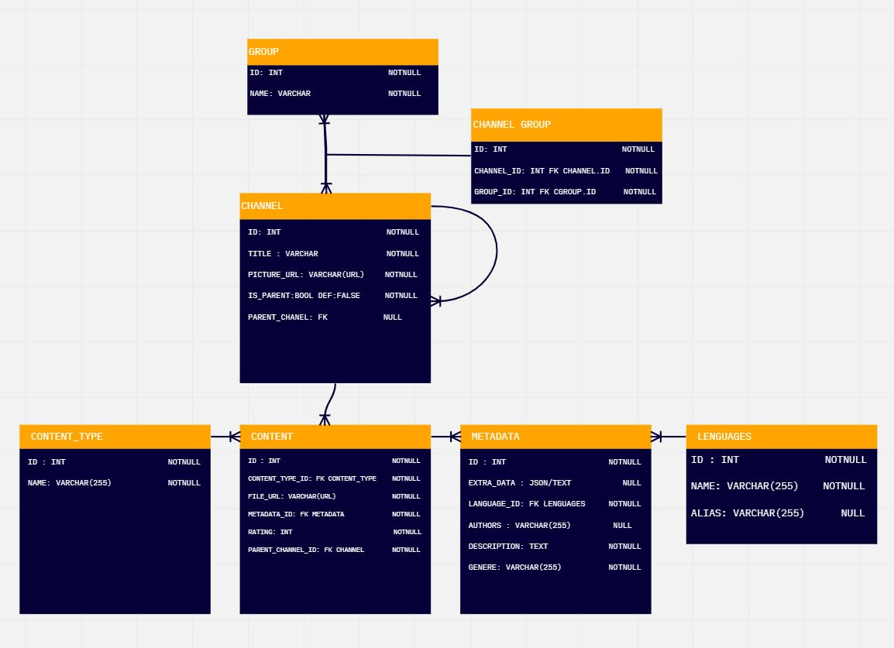

# Channels Api

## UML



## Installation
create virtual enviroment and activate it \
```bash
python3 -m venv env
source env/bin/activate
```
install requirements \
```bash
pip install -r requirements.txt
```
run migrations \
```bash
python manage.py migrate
```
create superuser \
```bash
python manage.py createsuperuser
```
run server \
```bash
python manage.py runserver
```
## Testing
run tests \
```bash
python manage.py test
```

## Endpoints 

### GET /api/group/<int:pk>  
Allow:  GET, PUT, PATCH, DELETE, HEAD, OPTIONS \
Content-Type: application/json \
query params: \
    - name: string name of the group \
Example : 
```json
        {
            "id": 1,
            "name": "group1",
            "channels": [
                24,
                23
            ]
        }
```
### GET /api/group/
Allow:  GET, POST, HEAD, OPTIONS \
Content-Type: application/json \
Example  : \
```json
        [
            {
                "id": 1,
                "name": "group1",
                "channels": [
                    24,
                    23
                ]
            },
            {
                "id": 2,
                "name": "group2",
                "channels": [
                    25,
                    26
                ]
            }
        ]

```
### GET /api/channel/<int:pk>/
Allow:  GET, PUT, PATCH, DELETE, HEAD, OPTIONS \
Content-Type: application/json \
Example : 
```json
        {
            "id": 23,
            "title": "Movies",
            "picture_url": "https://w7.pngwing.com/pngs/327/703/png-transparent-cinema-film-moveis-logo-film-art-film-thumbnail.png",
            "is_parent": true,
            "parent_channel": null,
            "date_created": "2023-02-11T18:43:57.156882Z",
            "groups": [
                1,
                2
            ]
        }
```
### GET /api/channel/
Allow:  GET, POST, HEAD, OPTIONS \
Content-Type: application/json \
query params: \
    - group: int  id of the group \
Example : 
```json
    [
    {
        "id": 23,
        "title": "Movies",
        "picture_url": "https://w7.pngwing.com/pngs/327/703/png-transparent-cinema-film-moveis-logo-film-art-film-thumbnail.png",
        "is_parent": true,
        "parent_channel": null,
        "date_created": "2023-02-11T18:43:57.156882Z",
        "groups": [
            1,
            2
        ]
    },
    {
        "id": 24,
        "title": "Series",
        "picture_url": "https://e1.pngegg.com/pngimages/312/318/png-clipart-video-formats-icon-tv-series-thumbnail.png",
        "is_parent": true,
        "parent_channel": null,
        "date_created": "2023-02-11T18:45:00.730561Z",
        "groups": [
            1
        ]
    },
    ]
```
### GET /api/channel/get_rating/<int:pk>/ 
Allow: GET, HEAD, OPTIONS \
Content-Type: application/json \
Example : 
```json
    {
    "channel": "Series",
    "rating": 8.5
    }
```

### GET /api/channel/export_ratings/
Allow: GET, HEAD, OPTIONS \
Returns a CSV file with all the ratings of the channels \
Example content of the CSV file: \
    Channel Title,Average Rating \
    Movies,9 \
    Vikings,9 \
    Action,9 \
    Series,8.5 \
    Better Call Saul,8 \

### GET /api/content_type/<int:pk>
Allow:  GET, PUT, PATCH, DELETE, HEAD, OPTIONS \
Content-Type: application/json \
Example : 
```json
        {
            "id": 1,
            "name": "Movie",
        }
```

### GET /api/content_type/ 
Allow:  GET, POST, HEAD, OPTIONS \
Content-Type: application/json \
query params: \
    - name: string name of the content type \
Example : 
```json
        [
            {
                "id": 1,
                "name": "Movie",
            },
            {
                "id": 2,
                "name": "Series",
            }
        ]
```

### GET /api/lenguage/<int:pk>/
Allow:  GET, PUT, PATCH, DELETE, HEAD, OPTIONS \
Example  : \
```json
        {
            "id": 1,
            "name": "English",
            "alias": "en"
        }
```
### GET /api/lenguage/
Allow:  GET, POST, HEAD, OPTIONS \
Content-Type: application/json \
query params: \
    - name: string name of the lenguage \
Example : 
```json
        [
            {
                "id": 1,
                "name": "English",
                "alias": "en"
            },
            {
                "id": 2,
                "name": "Spanish",
                "alias": "es"
            }
        ]
```

### GET /api/metadata/<int:pk>/
Allow:  GET, PUT, PATCH, DELETE, HEAD, OPTIONS \
Content-Type: application/json \
Example : 
```json
        {
    "id": 1,
    "extra_data": "{    
                    'grandma_of_the_author': 'Pamela Hirst',
                    'seasons': 6,
                    'episodes': 89,
                    'year': 2013,
                    ...
                    }",
    "authors": "Michael Hirst",
    "description": "Vikings transports us to the brutal and mysterious world of Ragnar Lothbrok, a Viking warrior and farmer who yearns to explore--and raid--the distant shores across the ocean. The series broadly follows the exploits of the legendary Viking chieftain Ragnar Lothbrok and his crew, and later those of his sons.",
    "genere": "Action, Historic",
    "lenguage_id": 2,
    "content_id": 1
    }
       
```

### GET /api/metadata/
Allow:  GET, POST, HEAD, OPTIONS \
Content-Type: application/json \
query params: \
    - id: int id of the metadata \
Example : 
```json
        [
            {
                "id": 1,
                "extra_data": "{    
                    'grandma_of_the_author': 'Pamela Hirst',
                    'seasons': 6,
                    'episodes': 89,
                    'year': 2013,
                    ...
                    }",
                "authors": "Michael Hirst",
                "description": "Vikings transports us to the brutal and mysterious world of Ragnar Lothbrok, a Viking warrior and farmer who yearns to explore--and raid--the distant shores across the ocean. The series broadly follows the exploits of the legendary Viking chieftain Ragnar Lothbrok and his crew, and later those of his sons.",
                "genere": "Action, Historic",
                "lenguage_id": 2,
                "content_id": 1
            },
            {
                "id": 2,
                "extra_data": "",
                "authors": "Vince Gilligan",
                "description": "The trials and tribulations of criminal lawyer, Jimmy McGill, in the time leading up to establishing his strip-mall law office in Albuquerque, New Mexico.",
                "genere": "Drama, Crime",
                "lenguage_id": 1,
                "content_id": 2
            }
        ]
```

### GET /api/content/<int:pk>/
Allow:  GET, PUT, PATCH, DELETE, HEAD, OPTIONS \
Content-Type: application/json \
Example : 
```json
        {  
            "id": 1,
            "title": "Rites of Passage S1 E1",
            "file_url": "https://www.youtube.com/watch?v=_LHYMTyp74s&ab_channel=SeriesJL",
            "date_created": "2023-02-11T19:10:52.714681Z",
            "rating": 9,
            "content_type": 2,
            "parent_channel": 25
        }
```

### GET /api/content/
Allow:  GET, POST, HEAD, OPTIONS \
Content-Type: application/json \
query params: \
    - id: int  id of the content \
    - parent_channel: int  id of the parent channel  of the content \
Example : 
```json
        [
            {
                "id": 1,
                "title": "Rites of Passage S1 E1",
                "file_url": "https://www.youtube.com/watch?v=_LHYMTyp74s&ab_channel=SeriesJL",
                "date_created": "2023-02-11T19:10:52.714681Z",
                "rating": 9,
                "content_type": 2,
                "parent_channel": 25
            },
            {
                "id": 2,
                "title": "Better Call Saul S1 E1",
                "file_url": "https://www.youtube.com/watch?v=5Zv5DYMfkoc&ab_channel=SeriesJL",
                "date_created": "2023-02-11T19:10:52.714681Z",
                "rating": 8,
                "content_type": 2,
                "parent_channel": 25
            }
        ]
```